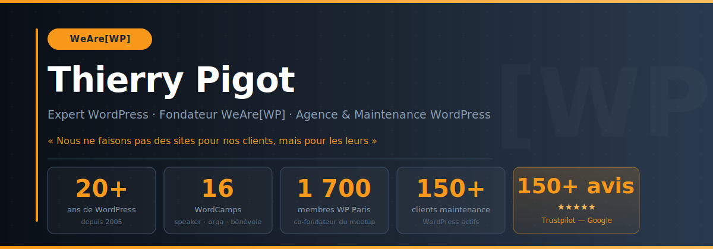

  

 

[![WeAre\[WP\]](https://img.shields.io/badge/WeAre%5BWP%5D-wearewp.pro-F7981B?style=flat-square&logo=wordpress&logoColor=1C2633)](https://wearewp.pro)&nbsp;
&nbsp;
&nbsp;

&nbsp;
&nbsp;
&nbsp;
&nbsp;

---

## Bonjour, je suis Thierry 👋

**WordPress depuis 2005** — avant les thèmes enfants, avant WooCommerce, avant Gutenberg. Je suis le fondateur de **[WeAre\[WP\]](https://wearewp.pro)**, agence WordPress basée à Laval, et de **[WP Assistance](https://wp-assistance.fr)**, spécialisée en maintenance et sécurité WordPress depuis 2013.

En 20 ans, j'ai accompagné des structures aussi diverses que **Ipsen, la Croix-Rouge française, l'AP-HP, Fujifilm, HEC Paris, le Ministère des Affaires Étrangères**, des collectivités locales, des startups et des TPE — avec une conviction constante : un site WordPress bien fait rapporte, un site mal maintenu coûte.

Co-fondateur du **Meetup WordPress Paris** (1 700 membres), speaker à **16 WordCamps**, contributeur traductions **Polyglots FR**, développeur de plugins publiés sur wordpress.org. WordPress n'est pas juste mon métier — c'est ma communauté.

> *« Nous ne faisons pas des sites pour nos clients, mais pour les leurs »*

---

## Ce que je fais

| Domaine | Détail |
|---|---|
| 🏗️ **Architecture WordPress** | FSE, Gutenberg, Block Patterns, thèmes sur mesure, ACF, WooCommerce |
| 🔒 **Sécurité & Maintenance** | 150+ sites actifs, désinfection, monitoring, mises à jour critiques |
| 🔍 **SEO & Performance** | Audits Core Web Vitals, RGAA, Opquast, éco-conception WordPress |
| 🌍 **Traductions WP FR** | Contributions Polyglots, glossaire officiel 602 termes, outils open source |
| 🎤 **Conférences & Formation** | 16 WordCamps, interventions HEC & Openska, 9 vidéos WordPress.tv |
| ⚙️ **Développement plugins** | Plugins wordpress.org actifs, 1 600+ installations cumulées |

---

## Open source

| Projet | Description | Installations |
|---|---|---|
| [BB Delete Cache](https://wordpress.org/plugins/bb-delete-cache/) | Vider le cache Beaver Builder en 1 clic depuis la barre d'administration | **900+** |
| [Toolbox for Beaver Builder](https://wordpress.org/plugins/toolbox-for-beaver-builder/) | Extensions UI pour Beaver Builder | **700+** |
| [wp-fr-typo](https://github.com/thierrypigot/wp-fr-typo) | Skill Claude Code — typographie & glossaire WordPress Polyglots FR | — |

---

## 16 WordCamps — temps forts

| Année | Événement | Rôle |
|---|---|---|
| **2026** | WordCamp Nice | 🎤 Speaker — *Les compositions WordPress au-delà du copier-coller* |
| **2019** | WordCamp Paris | 🎤 Speaker — *Faut-il être Technico pour être un bon Commercial ?* |
| **2017** | WordCamp Europe (Paris) | 🛠️ Organisateur |
| **2017** | WordCamp Marseille | 🎤 Speaker — *Les contenus personnalisés, késako ?* |
| **2016** | WordCamp Paris | 🛠️ Organisateur |
| **2015** | WordCamp Lyon | 🎤 Speaker ×2 — *Grandir avec WordPress* + *Store locator avec ACF* |
| **2015** | WordCamp Paris | 🛠️ Équipe d'organisation |
| **2014** | WordCamp Paris | 🎤 Speaker — *Combien coûte un site WordPress ?* |
| **2013** | WordCamp Paris | 🛠️ Organisateur |
| **2013** | WordCamp Europe (Leyde) | 🧩 Participant |
| *2008–2012* | *WordCamp Paris* | *Participant fidèle depuis le début* |

---

## Secteurs clients

`Santé & Pharma` · `ONG & Humanitaire` · `Industrie & Tech` · `Banque & Finance` · `Luxe` · `Enseignement supérieur` · `Institutions publiques` · `Droit` · `Éco-conception`

**Quelques références** — Ipsen · Croix-Rouge française · AP-HP · Malakoff Médéric · Fujifilm · Ricoh · BRED Banque Populaire · HEC Paris · Université Paris Diderot · Ministère des Affaires Étrangères · Ambassades · Lorenz Bäumer Paris · Enfants du Mékong · Solidarités International · CNRS · Groupe Casino

---

## Retrouvez-moi

[![WeAre\[WP\]](https://img.shields.io/badge/WeAre%5BWP%5D-Agence%20WordPress-F7981B?style=for-the-badge&logo=wordpress&logoColor=1C2633)](https://wearewp.pro)&nbsp;
&nbsp;

&nbsp;
&nbsp;

&nbsp;
&nbsp;

---

*WordPress depuis 2005 · Laval, France · Co-fondateur WP Paris (1 700 membres) · 84 avis ★★★★★ Trustpilot*

